<style>
  .title {
    text-align: center;
    margin: 20px 0;
  }
  
  .content-wrapper {
    min-height: calc(100vh - 100px);
    position: relative;
  }
  
  .school-name {
    text-align: center;
    margin-top: 200px;
  }
</style>


<style>
  /* 代码块样式 */
  .code-block {
    margin-left: 2em;
  }
  .code-block pre {
    background-color: #f5f5f5 !important;
    padding: 1em;
    border-radius: 4px;
    margin: 1em 0;
  }

  /* 页码样式 */
  .page-number {
    position: running(pageNumber);
    text-align: center;
  }
  
  @page {
    margin: 1in;
    @bottom-center {
      content: counter(page);
    }
  }

  /* 首页和目录页不显示页码 */
  .no-page-number {
    page: no-number;
  }
  @page no-number {
    @bottom-center {
      content: none;
    }
  }
</style>

<div class="content-wrapper">

<div class="title">

# 计算机组成原理实验报告

## 作业名称：ALU设计个人实验报告

</div>

- **姓名**：饶甜甜
- **专业班级**：2023级计算机科学与技术⼀班
- **学号**：320230943420
- **指导教师**：冯晓琴
- **实验⽇期**：2025年3⽉2⽇-3⽉10⽇

<div class="school-name">
兰州大学信息科学与工程学院
</div>

---
<!-- 分页符 -->
<div style="page-break-after: always"></div>


[toc]

---
<!-- 分页符 -->
<div style="page-break-after: always"></div>
<style>
  h1 {
    text-align: center;
    font-size: 2em; 
  }
</style>


## 1 引⾔
本报告主要是阐释我在本次实验中所做的贡献以及学习到的知识和收获。

## 2 实验⽬的
本实验旨在设计⼀个⽀持32位⻰芯、MIPS或RISC-V指令集架构的算术逻辑单元（ALU），实现16种功能，包括⽆符号除法 ⽆符号乘法 有符号除法 有符号乘法 加法 减法 有符号⽐较 ⽆符号⽐较 按位与 按位或⾮ 按位或 按位异或 逻辑左移 逻辑右移 算术右移 ⾼位加载。其中，在软件层⾯上我负责搭建框架、实现其中四种功能，硬件层⾯上我和另⼀位同学⼀起负责部署开发板以及测试优化。

具体实验⽬的包括：
1. 学习ALU的⼯作原理、架构设计及其在微处理器中的核⼼作⽤，包括如何处理算术和逻辑运算。
2. 通过设计超前进位加法器、组合/时序移位器、乘法器、除法器等，探究并实现更⾼效和⾼级的运算功能。
3. 学习掌握使⽤Verilog进⾏硬件设计和描述，包括信号定义、模块设计、时序控制等基本要素。并使⽤Vivado软件进⾏仿真，实施ALU设计，⽣成⽐特流⽂件，部署到实验箱FPGA上，实现实际功能演⽰。
4. 在实验过程中，锻炼与他⼈合作的能⼒，共同解决设计与实现中的问题，分享设计思路及实现过程中遇到的挑战。
5. 理解ALU如何与其他组件（如寄存器、控制单元）交互，形成完整的计算机内部操作，理解ALU在现代计算机架构中的重要性，提升硬件设计与实现能⼒，为今后更复杂的系统设计奠定基础。

## 3 个⼈贡献
在本次ALU设计实验中，我负责的⼯作包括：
1. 整体ALU框架的设计与搭建
   - 参与构建ALU的基本结构，包括输⼊输出端⼝定义和控制信号解码
   - 实现独热编码控制逻辑，确保各个功能单元的正确调⽤
   - 协调不同操作之间的数据流和控制流
2. 移位操作、⾼位加载功能的实现
   - 设计并实现逻辑左移（sll）功能
   - 设计并实现逻辑右移（srl）功能
   - 设计并实现算术右移（sra）功能
   - 实现⾼位加载功能
3. 硬件部署与测试
   - 将设计部署到开发板上进⾏实际硬件测试
   - 识别和解决硬件测试过程中发现的问题
   - 优化设计以提⾼性能和稳定性

## 4 设计原理
### 4.1 ALU整体架构设计（我负责的部分）
在本次实验中，我负责了设计ALU的整体架构，包括模块划分、接⼝定义和控制信号解码。ALU模块的设计考虑了可扩展性、可测试性和实际硬件实现的可⾏性。

#### 4.1.1 模块层次结构
本次设计的模块层次结构包括：
1. 顶层模块（alu_display.v）：负责协调整个系统，处理⽤⼾输⼊和显⽰输出
2. ALU功能模块（alu.v）：实现除了加法器以外具体的算术逻辑运算功能
3. 加法器模块（adder.v）：作为ALU的⼦模块，实现⾼效的加法运算

这种分层设计使得各个模块可以独⽴开发和测试，同时便于团队成员协作开发，具体如下图所⽰：
<center>
   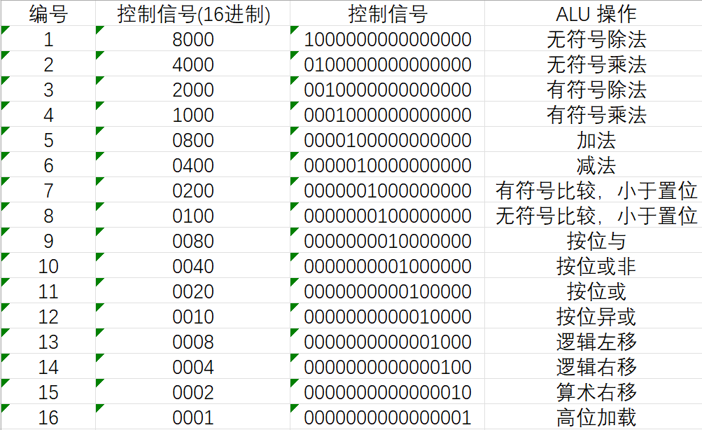
</center>


#### 4.1.2 控制信号设计
我设计了采⽤独热编码（one-hot encoding）的控制信号，每⼀位表⽰⼀种操作。这种设计的优点是：
- 解码逻辑简单，只需检测对应位是否为1
- 便于扩展新的功能，只需增加新的控制位
- 减少了功能切换时的⽑刺和冲突可能性

独热码的设计如下图所⽰：

<center>
   
</center>

#### 4.1.3 结果选择逻辑
本次实验设计的ALU通过条件选择器来确定最终输出的结果，根据控制信号选择相应操作的输出。这种设计⽅式确保了只有被激活的操作结果会被传递到输出端⼝，提⾼了电路的效率和稳定性。

### 4.2 移位操作和⾼位加载功能的实现（我负责的功能）
在ALU设计中，我负责实现的移位操作包括逻辑左移、逻辑右移和算术右移，还有⾼位加载功能。这些操作是处理器中常⽤的位操作，对于⾼效实现各种数据处理任务⾄关重要。

#### 4.2.1 逻辑左移（sll）的实现
逻辑左移是将⼆进制数向左移动指定的位数，右侧空出的位置补0。我的实现采⽤了多级移位的⽅式，这种⽅式⽐简单的循环移位更⾼效，能够在更少的时钟周期内完成操作。

具体实现分为三步：

1. 第⼀级移位（低2位）：根据移位量的低2位（shf[1:0]）进⾏初步移位
```verilog
assign sll_step1 = {32{shf_1_0 == 2'b00}} & alu_src2 // 若s
| {32{shf_1_0 == 2'b01}} & {alu_src2[30:0], 1'd0} // 若s
| {32{shf_1_0 == 2'b10}} & {alu_src2[29:0], 2'd0} // 若s
| {32{shf_1_0 == 2'b11}} & {alu_src2[28:0], 3'd0}; // 若s
```

2. 第⼆级移位（位3-4）：根据移位量的[3:2]位继续移位
```verilog
assign sll_step2 = {32{shf_3_2 == 2'b00}} & sll_step1 // 若s
| {32{shf_3_2 == 2'b01}} & {sll_step1[27:0], 4'd0} // 若s
| {32{shf_3_2 == 2'b10}} & {sll_step1[23:0], 8'd0} // 若s
| {32{shf_3_2 == 2'b11}} & {sll_step1[19:0], 12'd0}; // 若s
```

3. 第三级移位（位5）：根据移位量的第4位决定是否再移位16位
```verilog
assign sll_result = shf[4] ? {sll_step2[15:0], 16'd0} : sll_step2; // 若s
```

这种分级移位的设计能够最⼩化电路延迟，实现⾼效的移位操作。注意我使⽤的是位拼接和条件选择的组合逻辑⽅式，⽽不是循环或顺序逻辑，这使得整个移位操作可以在⼀个时钟周期内完成。

#### 4.2.2 逻辑右移（srl）的实现
逻辑右移将⼆进制数向右移动指定的位数，左侧空出的位置补0。我的实现与逻辑左移类似，也采⽤了三级移位结构：

1. 第⼀级移位（低2位）：根据移位量低2位进⾏初步移位，左侧补0
```verilog
assign srl_step1 = {32{shf_1_0 == 2'b00}} & alu_src2 // 若s
| {32{shf_1_0 == 2'b01}} & {1'd0, alu_src2[31:1]} // 若s
| {32{shf_1_0 == 2'b10}} & {2'd0, alu_src2[31:2]} // 若s
| {32{shf_1_0 == 2'b11}} & {3'd0, alu_src2[31:3]}; // 若s
```

2. 第⼆级移位（位3-4）：根据移位量的[3:2]位继续移位
```verilog
assign srl_step2 = {32{shf_3_2 == 2'b00}} & srl_step1 // 若s
| {32{shf_3_2 == 2'b01}} & {4'd0, srl_step1[31:4]} // 若s
| {32{shf_3_2 == 2'b10}} & {8'd0, srl_step1[31:8]} // 若s
| {32{shf_3_2 == 2'b11}} & {12'd0, srl_step1[31:12]}; // 若s
```

3. 第三级移位（位5）：根据移位量的第4位决定是否再移位16位
```verilog
assign srl_result = shf[4] ? {16'd0, srl_step2[31:16]} : srl_step2; // 若s
```

通过这种三级结构，最多只需要进⾏3次复⽤逻辑判断，就能完成0-31位范围内任意位数的逻辑右移操作。

#### 4.2.3 算术右移（sra）的实现
算术右移是逻辑右移的⼀个变种，但关键区别在于左侧空出的位置补充的是原数的符号位，⽽不是简单地补0。这⼀特性使得算术右移能够保持有符号数（补码）的性质：
- 对于正数（符号位为0），算术右移与逻辑右移相同，⾼位补0
- 对于负数（符号位为1），算术右移时⾼位补1

我的实现同样采⽤三级移位结构，但在每⼀级补位时都使⽤了原操作数的符号位：

1. 第⼀级移位（低2位），左侧补符号位
```verilog
assign sra_step1 = {32{shf_1_0 == 2'b00}} & alu_src2
| {32{shf_1_0 == 2'b01}} & {alu_src2[31], alu_src2[31:1]}
| {32{shf_1_0 == 2'b10}} & {{2{alu_src2[31]}}, alu_src2[31:2
| {32{shf_1_0 == 2'b11}} & {{3{alu_src2[31]}}, alu_src2[31:3
```

2. 第⼆级移位（位3-4），左侧继续补符号位
```verilog
assign sra_step2 = {32{shf_3_2 == 2'b00}} & sra_step1
| {32{shf_3_2 == 2'b01}} & {{4{sra_step1[31]}}, sra_step1[31
| {32{shf_3_2 == 2'b10}} & {{8{sra_step1[31]}}, sra_step1[31
| {32{shf_3_2 == 2'b11}} & {{12{sra_step1[31]}}, sra_step1[3
```

3. 第三级移位（位5），左侧继续补符号位
```verilog
assign sra_result = shf[4] ? {{16{sra_step2[31]}}, sra_step2[31:16]} : sra_st
```

注意在实现中，我使⽤了Verilog的复制语法 {n{expression}} 来重复填充符号位，例如 {4{sra_step1[31]}} 表⽰将第⼀级移位结果的符号位复制4次。

#### 4.2.4 ⾼位加载功能实现
⾼位加载是将第⼆个操作数的低16位加载到结果的⾼16位，同时保持低16位为0的操作。这⼀功能常⽤于MIPS架构中的 lui 指令，⽤于⽴即数的⾼16位加载。我的实现直接通过位拼接完成：

```verilog
assign lui_result = {alu_src2[15:0], 16'd0};
```

这种简单⾼效的实现确保了⾼位加载操作的快速执⾏。具体来说，取第⼆个操作数alu_src2的低16位，拼接上16个0，形成最终的32位结果。

通过组合逻辑实现这些操作，该设计能够在⼀个时钟周期内完成任意位数的移位操作，具有⾼效性和低延迟的特点。

### 4.3 其他模块简述
本节简要介绍由其他组员负责实现的模块，以提供完整的系统视图。

#### 4.3.1 加法器模块
加法器模块采⽤超前进位加法器（CLA）设计，通过预计算进位信号减少加法运算的延迟。该模块由多个4位CLA⼦模块组成，能够⾼效处理32位数据的加法运算。

#### 4.3.2 乘法和除法实现
ALU⽀持有符号和⽆符号乘除法操作，其中：
- 有符号乘法使⽤改进的Booth算法
- ⽆符号乘法采⽤移位加法算法
- 有符号除法使⽤逐位恢复法
- ⽆符号除法实现⼆进制⻓除法

#### 4.3.3 逻辑运算实现
ALU⽀持基本的逻辑运算，包括按位与、按位或、按位异或和按位或⾮等，这些操作通过简单的位操作直接实现。

## 5 仿真与实现
tb.v ⽂件中，我们列出了各个功能的测试⽤例，这⾥仅展⽰我负责的四个功能，其他功能在⼩组报告中已经列出。

### 5.1 逻辑左移测试
控制信号： alu_control = 16'b0000_0000_0000_1000
1. ⼩量移位
   - 输⼊：
     - alu_src1 = 32'd4 // 0b'0000'0000'0000'0000'0000'0000'0000'0100
     - alu_src2 = 32'hF // 0b'0000'0000'0000'0000'0000'0000'0000'1111
   - 实际输出：
     - result = 32'hF0 // 0b'0000'0000'0000'0000'0000'0000'1111'0000

2. 零位移
   - 输⼊：
     - alu_src1 = 32'd0 // 0b'0000'0000'0000'0000'0000'0000'0000'0000
     - alu_src2 = 32'hABCDEF01 // 0b'1010'1011'1100'1101'1110'1111'0000'0001
   - 实际输出：
     - result = 32'hABCDEF01 // 0b'1010'1011'1100'1101'1110'1111'0000'0001

3. ⼤量移位
   - 输⼊：
     - alu_src1 = 32'd24 // 0b'0000'0000'0000'0000'0000'0000'0001'1000
     - alu_src2 = 32'hFF // 0b'0000'0000'0000'0000'0000'0000'1111'1111
   - 实际输出：
     - result = 32'hFF000000 // 0b'1111'1111'0000'0000'0000'0000'0000'0000

逻辑左移功能仿真结果如图所⽰，符合设计要求。

<center>
   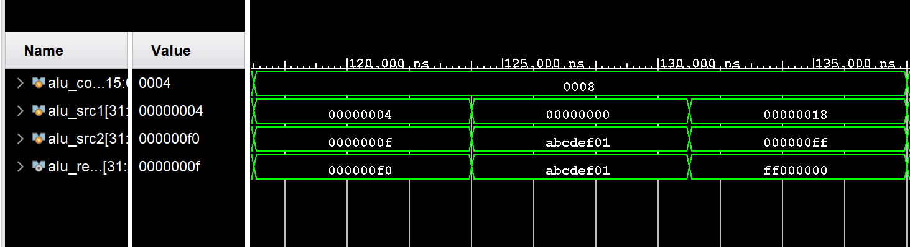
</center>


### 5.2 逻辑右移
控制信号： alu_control = 16'b0000_0000_0000_0100

1. 逻辑右移-⼩量移位
   - 输⼊控制信号： alu_control = 16'b0000_0000_0000_0100
   - 输⼊：
     - alu_src1 = 32'd4 // 0b'0000'0000'0000'0000'0000'0000'0000'0100
     - alu_src2 = 32'hF0 // 0b'1111'0000'0000'0000'0000'0000'0000'0000
   - 实际输出：
     - result = 32'h0F // 0b'0000'0000'0000'0000'0000'0000'0000'1111

2. 逻辑右移-⼤量移位
   - 输⼊：
     - alu_src1 = 32'd28 // 0b'0000'0000'0000'0000'0000'0000'0001'1100
     - alu_src2 = 32'hF0000000 // 0b'1111'0000'0000'0000'0000'0000'0000'0000
   - 实际输出：
     - result = 32'h0000000F // 0b'0000'0000'0000'0000'0000'0000'0000'1111

逻辑右移功能仿真结果如图所⽰，符合设计要求。

<center>
   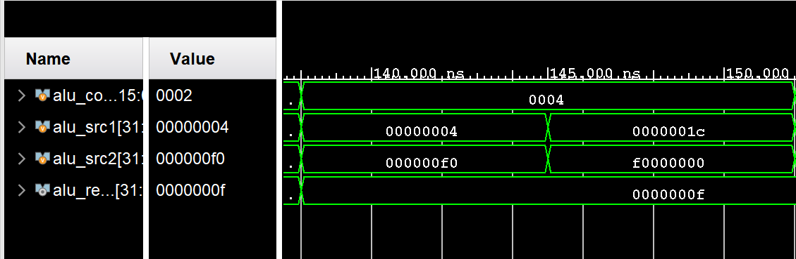
</center>

### 5.3 算术右移
输⼊控制信号： alu_control = 16'b0000_0000_0000_0010

1. 算术右移-正数
   - 输⼊：
     - alu_src1 = 32'd4 // 0b'0000'0000'0000'0000'0000'0000'0000'0100
     - alu_src2 = 32'h000000F0 // 0b'0000'0000'0000'0000'0000'0000'1111'0000
   - 实际输出：
     - result = 32'h0000000F // 0b'0000'0000'0000'0000'0000'0000'0000'1111

2. 算术右移-负数
   - 输⼊：
     - alu_src1 = 32'd4 // 0b'0000'0000'0000'0000'0000'0000'0000'0100
     - alu_src2 = 32'hF0000000 // 0b'1111'0000'0000'0000'0000'0000'0000'0000
   - 实际输出：
     - result = 32'hFF000000 // 0b'1111'1111'0000'0000'0000'0000'0000'0000

3. 算术右移-负数⼤量移位
   - 输⼊：
     - alu_src1 = 32'd28 // 0b'0000'0000'0000'0000'0000'0000'0001'1100
     - alu_src2 = 32'hF0000000 // 0b'1111'0000'0000'0000'0000'0000'0000'0000
   - 实际输出：
     - result = 32'hFFFFFFFF // 0b'1111'1111'1111'1111'1111'1111'1111'1111

算数右移功能仿真结果如图所⽰，符合设计要求。

<center>
   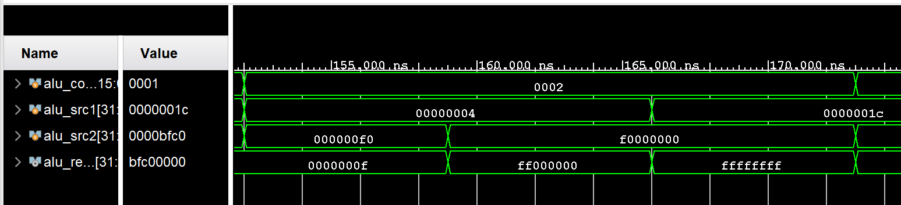
</center>

### 5.4 ⾼位加载测试
输⼊控制信号： alu_control = 16'b0000_0000_0000_0001

输⼊：
- alu_src2 = 32'h0000BFC0 // 0b'0000'0000'0000'0000'1011'1111'1100'0000

实际输出：
- result = 32'hBFC00000 // 0b'1011'1111'1100'0000'0000'0000'0000'0000

⾼位加载功能仿真结果如图所⽰，符合设计要求。

<center>
   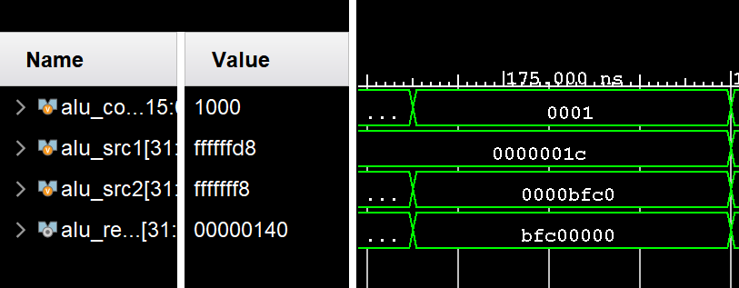
</center>

### 5.12 上板测试
我们在使⽤Vivado软件进⾏仿真，验证ALU的功能正确性之后，⽣成⽐特流以部署在FPGA实验箱上，我负责这⼀部分的测试与优化，这⾥仅展⽰我负责的四个功能，其他功能在⼩组报告中已经列出。

- **逻辑左移**

<center>
   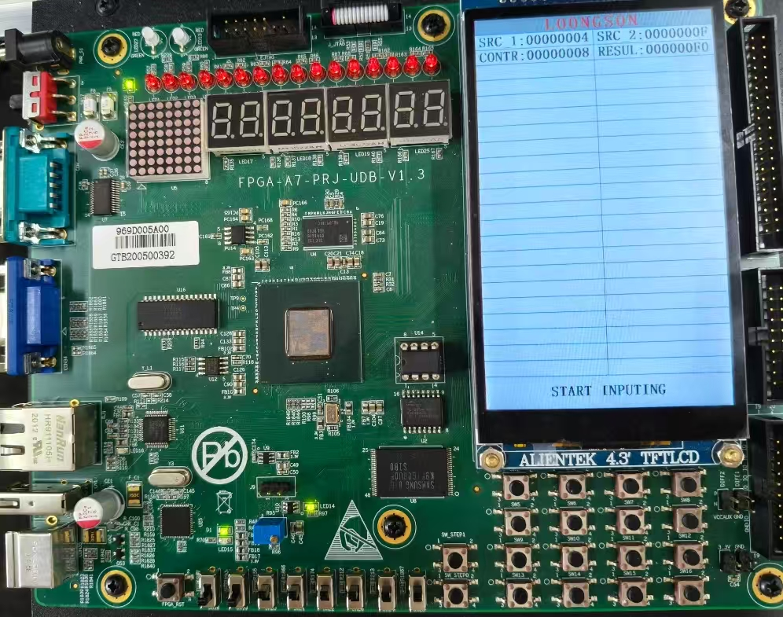
</center>

<center>
   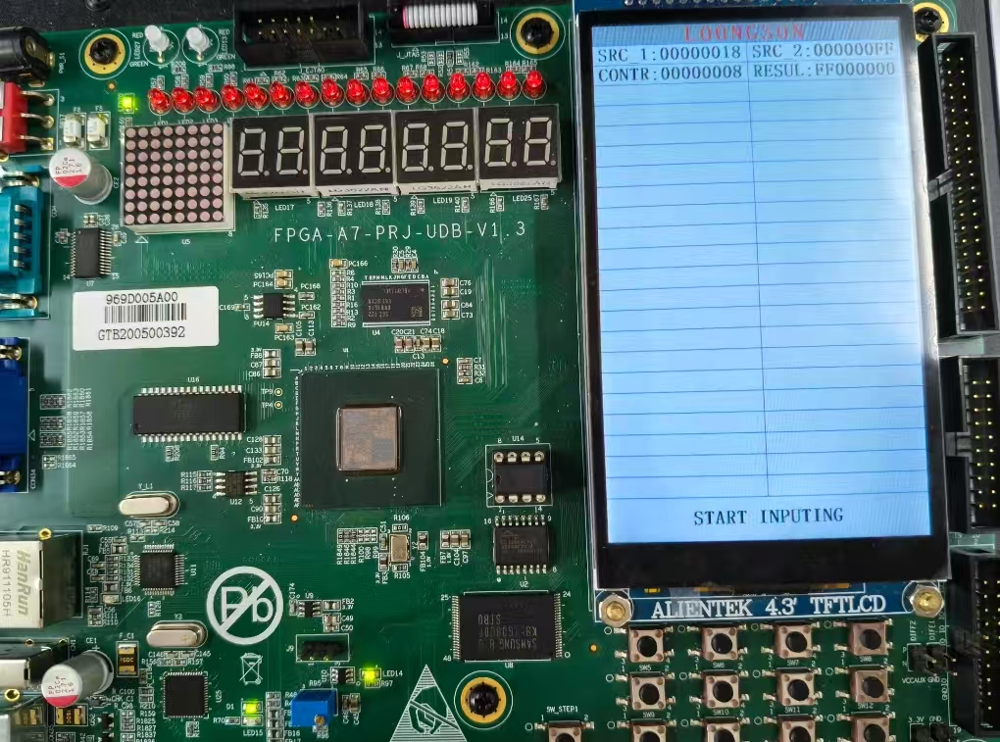
</center>

- **逻辑右移**

<center>
   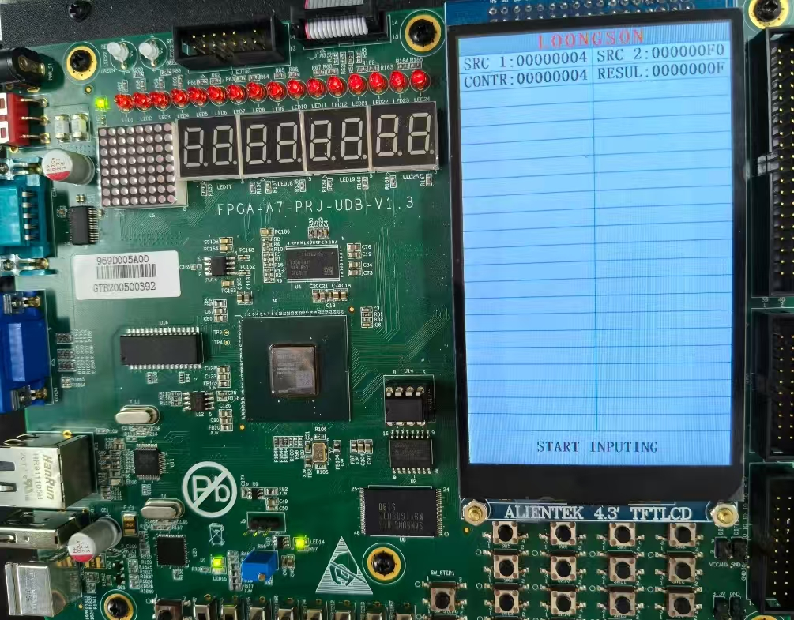
</center>

<center>
   
</center>

- **算术右移**

<center>
   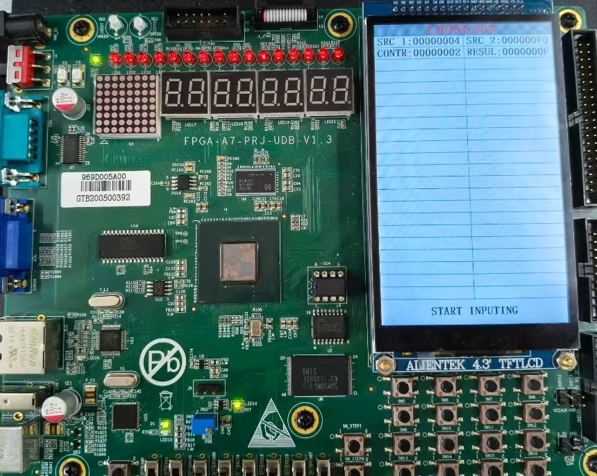
</center>

<center>
   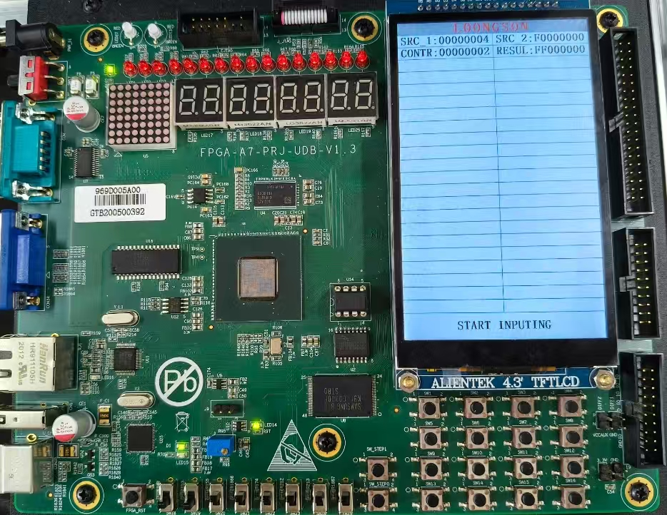
</center>

- **高位加载**

<center>
   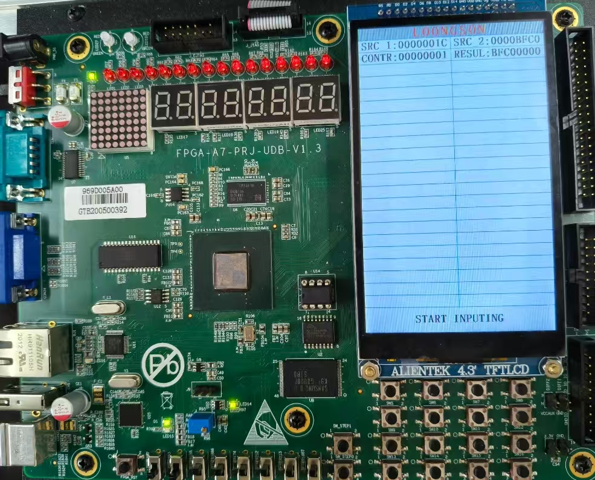
</center>


## 6 思考题
### 6.1 ALU的结构与组成
ALU (算术逻辑单元) 是CPU核⼼组件之⼀，负责执⾏各种算术和逻辑运算。本次实验中该ALU的结构主要由以下⼏个部分组成：
1. 控制信号解码部分：将16位的独热码控制信号 alu_control 解码为各种操作类型的信号，如 alu_add 、 alu_sub 等。
2. 基本逻辑运算部分：包括与( and )、或( or )、或⾮( nor )、异或( xor )、⾼位加载( lui )等简单的位运算操作，这些操作直接通过组合逻辑实现。
3. 加法器：作为⼀个核⼼组件，不仅⽤于实现加法( add )，还被复⽤于减法( sub )、⽐较操作( slt , sltu )。通过对操作数和进位控制，可以实现多种功能。
4. 移位器：实现逻辑左移( sll )、逻辑右移( srl )和算术右移( sra )，使⽤多级移位⽅式提⾼效率。
5. 乘法器：分为有符号乘法( mul )和⽆符号乘法( mulu )，使⽤Booth算法的变体实现。
6. 除法器：分为有符号除法( div )和⽆符号除法( divu )，分别采⽤恢复余数法实现。
7. 结果选择部分：根据控制信号从各个部分的结果中选择最终的输出。

不同运算器之间的关系主要体现在资源复⽤和功能层次上：
- 资源复⽤：加法器被多个操作共⽤，如加法、减法、⽐较操作都依赖于同⼀个加法器模块。
- 平⾏结构：逻辑运算部分、移位器、乘